# kubecon2023
Just some notes on KubeCon 2023

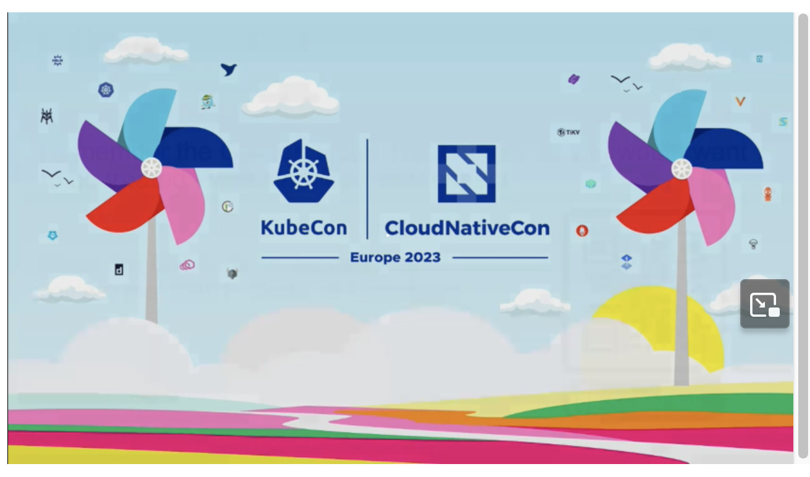


# A CI/CD Platform in the Palm of Your Hand - Claudia Beresford, Weaveworks

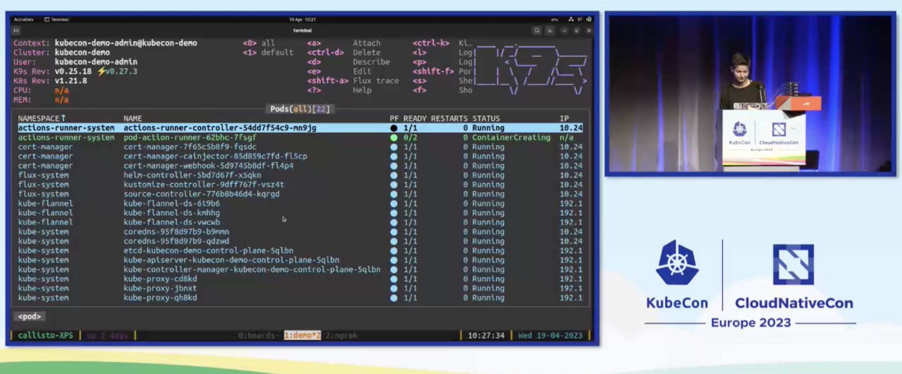

## MicroVMs

MicroVMs for a better sweet spot for CI than security-flawed containers or full-blown VMs (see https://itnext.io/microvm-another-level-of-abstraction-for-serverless-computing-5f106b030f15?gi=62ad462da87f).


Deployment on MicroVMs or directly on bare metal:

https://github.com/weaveworks-liquidmetal


clusterctl CLI

> ngrok is a simplified API-first ingress-as-a-service that adds connectivity,
security, and observability to your apps in one line 

https://ngrok.com/


# How We Securely Scaled Multi-Tenancy with VCluster, Crossplane, and Argo CD - Ilia Medvedev & Kostis Kapelonis, Codefresh

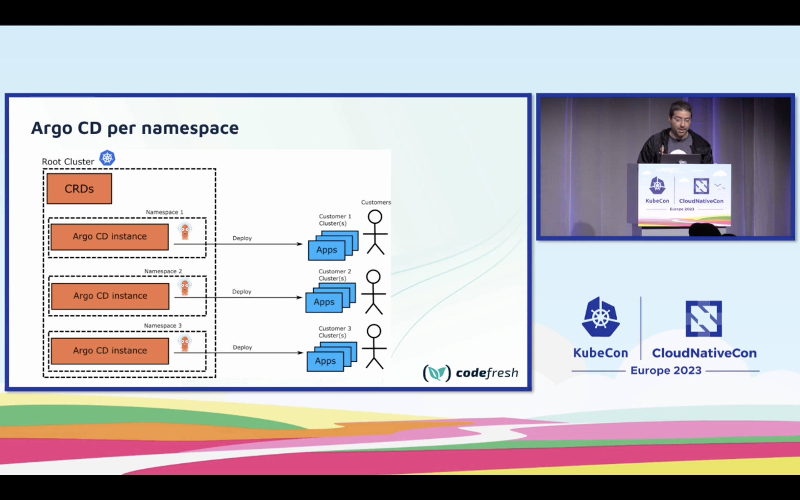

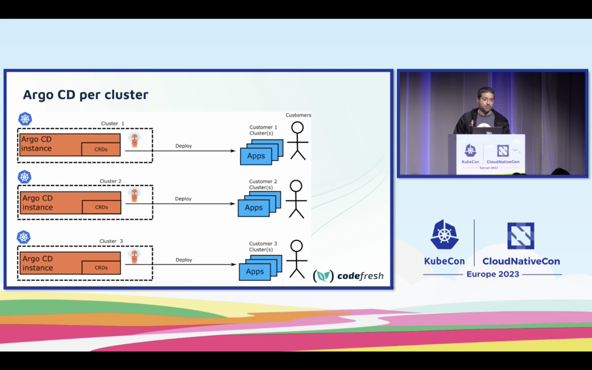

3rd option:

https://www.vcluster.com/

k8s cluster in k8s cluster - clusterception

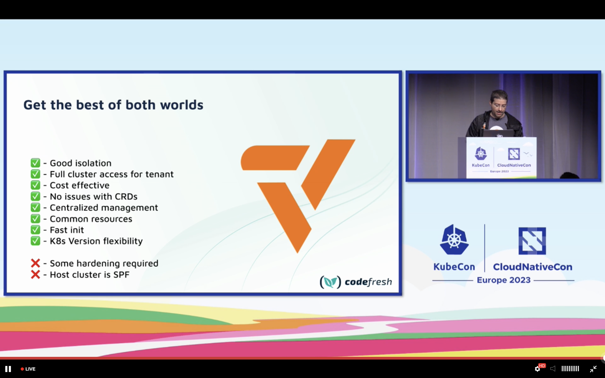

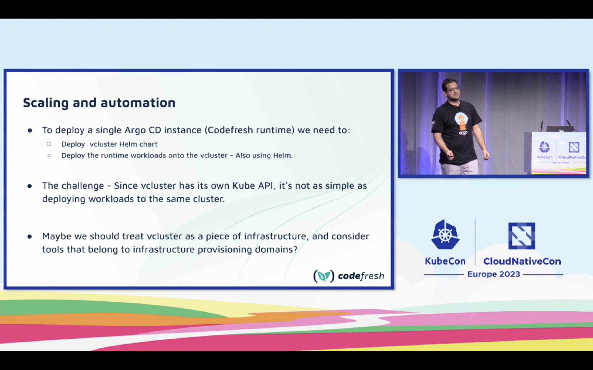

Really cool, here's there are architecture

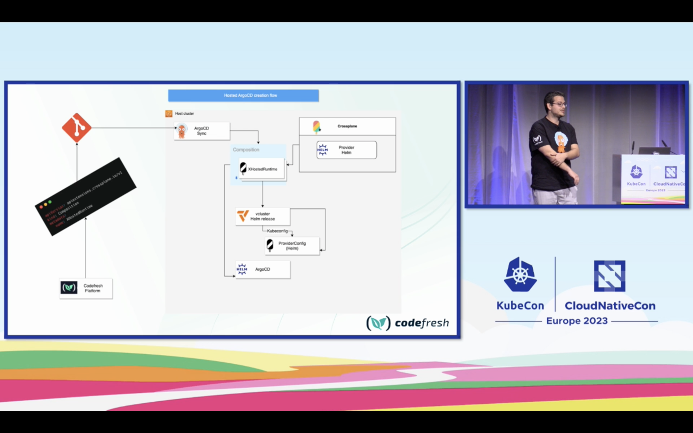

Install crossplane using Helm with ArgoCD

Demo repo https://github.com/ilia-medvedev-codefresh/kubecon-2023-demo


ArgoCD certification https://learning.codefresh.io/


# Hands on with WebAssembly Microservices and Kubernetes - Jiaxiao Zhou, David Justice & Kate Goldenring, Microsoft & Radu Matei, Fermyon

https://github.com/deislabs/kc-eu-2023-k8s-wasm-microservices

## WebAssembly (Wasm)

> Is a compilation target producing small binaries, that start up really fast

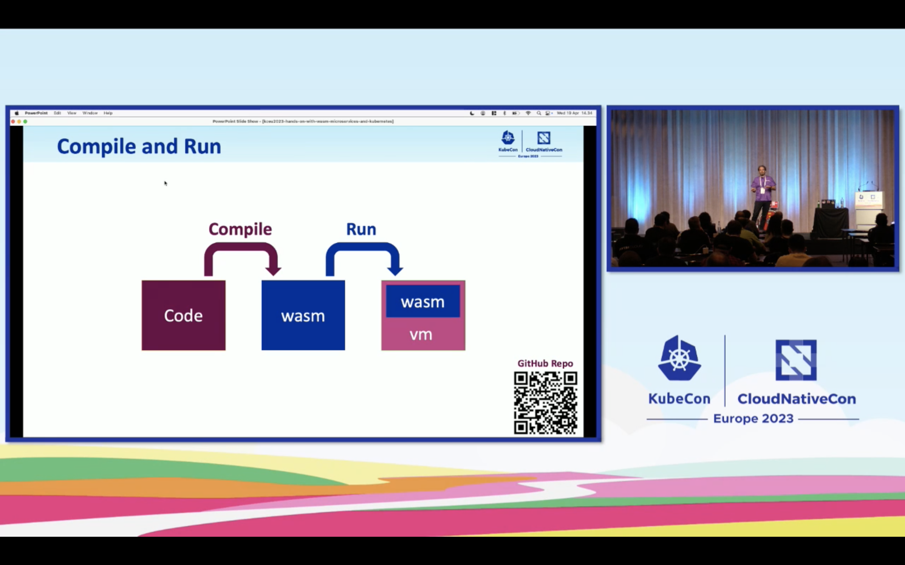

- run inside or outside of the Browser

Wasm supported languages:

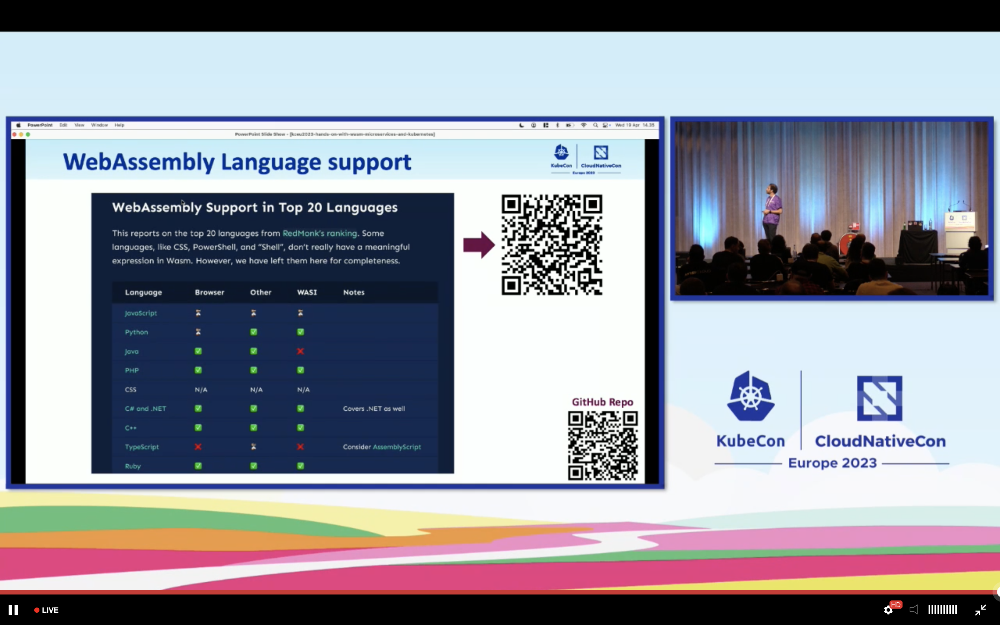

### WebAssembly Runtimes:

JavaScript and WASI (server-side)

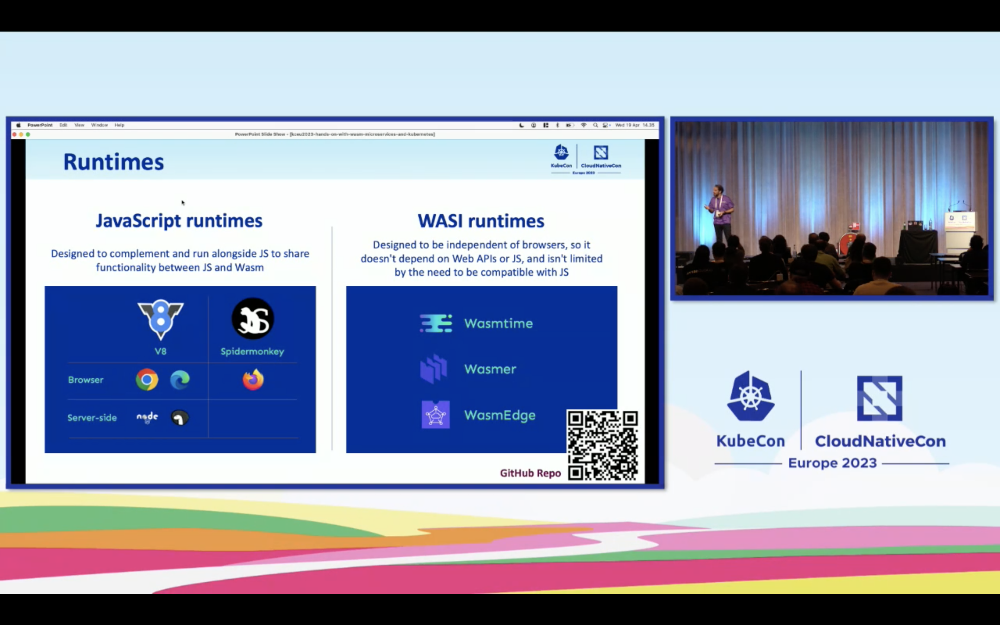

e.g. https://wasmtime.dev/

WASI features

portable, secure, small, quick

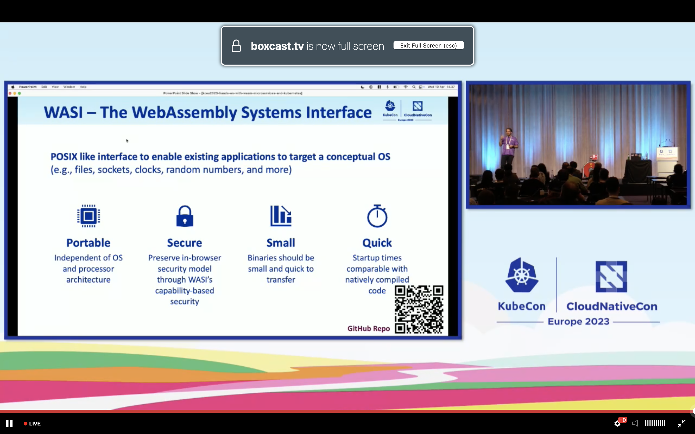


### 3 options to run WebAssembly

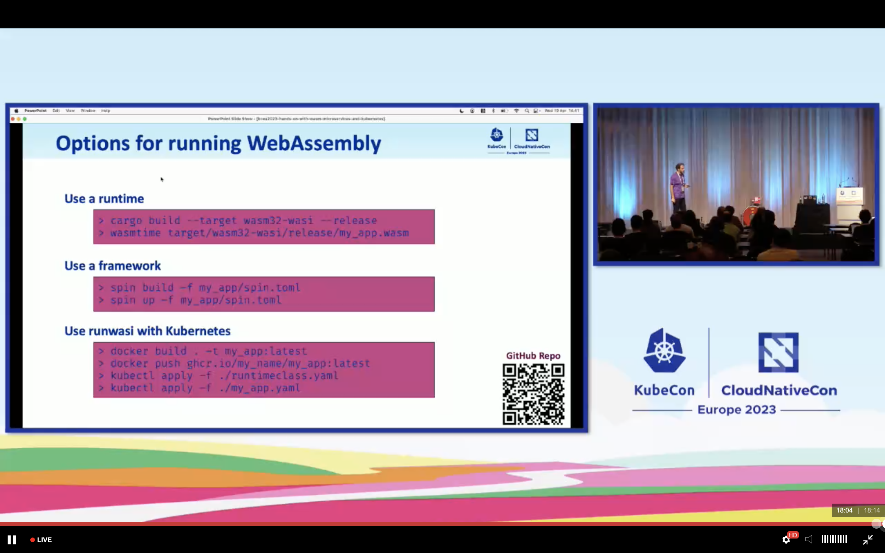

* Use a runtime like wasmtime

* Use a framework like spin https://github.com/fermyon/spin

* Use Kubernetes with runwasi


### Spin

> the developer tool for Serverless WebAssembly

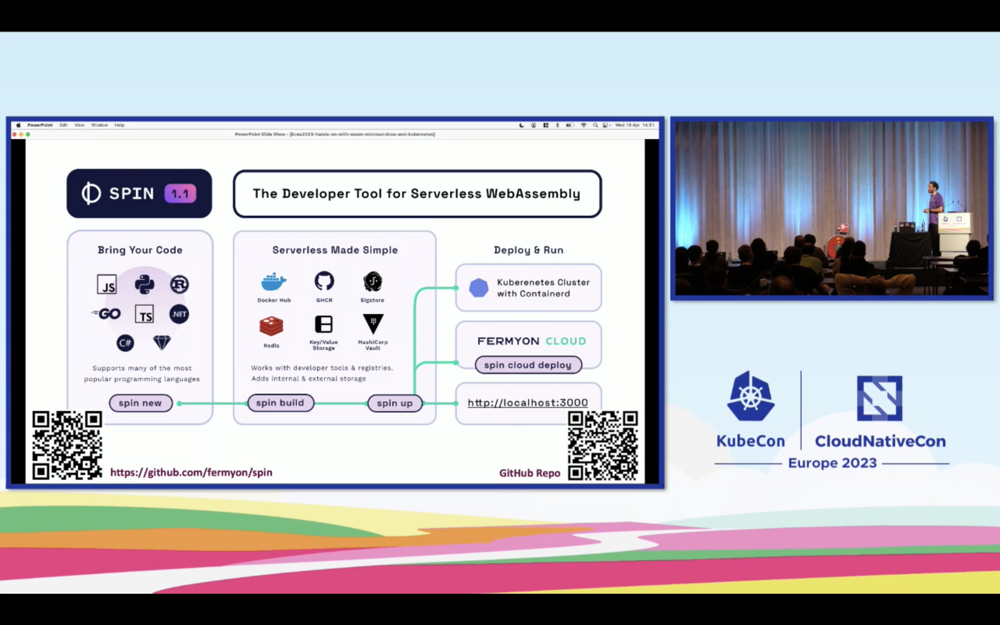

> right now there's no multithreading inside Spin applications 

commands remind us to Docker:

```shell
$ spin new

$ spin build

$ spin up
```

Spin produces OCI containers... 

### Workshop

prepare https://github.com/deislabs/kc-eu-2023-k8s-wasm-microservices/blob/main/workshop/00-setup.md

```shell
# install spin
$ curl -fsSL https://developer.fermyon.com/downloads/install.sh | bash
$ sudo mv spin /usr/local/bin/
# check command
spin --version

# configure templates
# Install the official Spin templates.
$ spin templates install --git https://github.com/fermyon/spin --update
$ spin templates install --git https://github.com/fermyon/spin-js-sdk --update

# Install a few templates we will use to build applications.
$ spin templates install --git https://github.com/radu-matei/spin-kv-explorer --update

# Install the JavaScript plugin for Spin.
$ spin plugin install js2wasm -y

```

Spin 101 https://github.com/deislabs/kc-eu-2023-k8s-wasm-microservices/blob/main/workshop/01-spin-getting-started.md

```shell
$ spin new http-ts hello-typescript --accept-defaults && cd hello-typescript

$ tree
.
├── README.md
├── package.json
├── spin.toml
├── src
│   └── index.ts
├── tsconfig.json
└── webpack.config.js
```

build app with

```shell
$ npm install

$ spin build
```

run and access app

```shell
$ spin up

$ curl localhost:3000
```

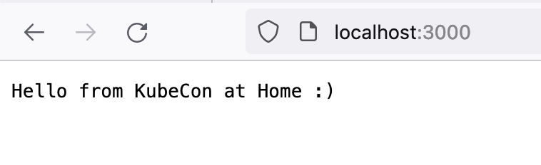


## Wasm in Kubernetes

https://github.com/deislabs/kc-eu-2023-k8s-wasm-microservices/blob/main/workshop/02-run-your-first-wasm-on-k3d.md

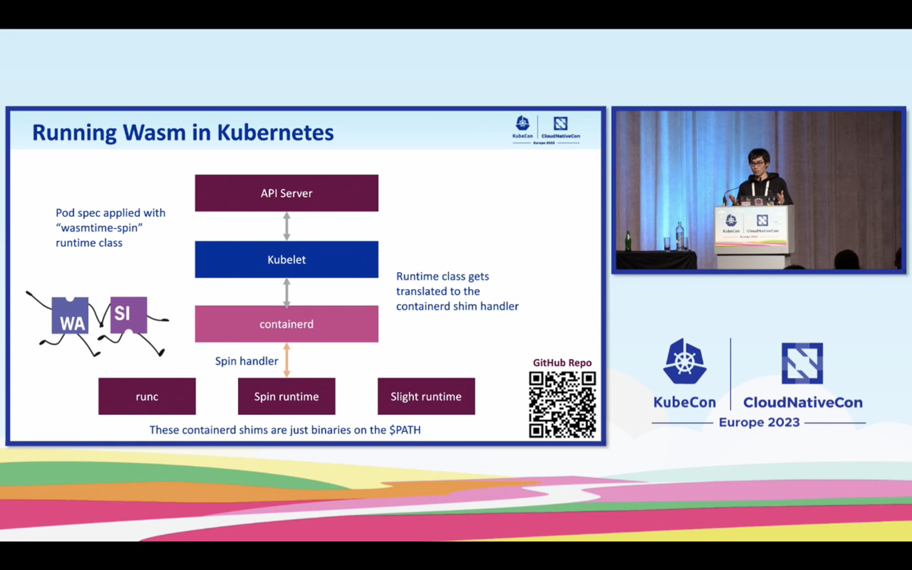

runwasi is a shim implementation to run WebAssembly

Pod spec runtime class defintion - wasmtime-spin

`RuntimeClass` CRD for that:

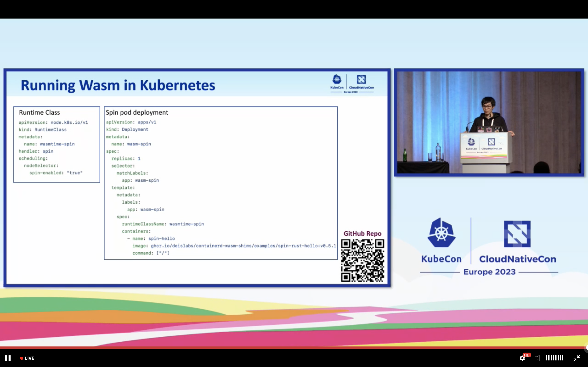

Create 

```shell
$ k3d cluster create wasm-cluster --image ghcr.io/deislabs/containerd-wasm-shims/examples/k3d:v0.5.1 -p "8081:80@loadbalancer" --agents 2
```

ContainerD can have multiple shims installed (slight + Spin for example)

Multiple RuntimeClasses: https://github.com/deislabs/containerd-wasm-shims/raw/main/deployments/workloads/runtime.yaml

Add kubeconfig to your local config:

```shell
k3d kubeconfig get wasm-cluster
```

Install RuntimeClasses & workload

```shell
kubectl apply -f https://github.com/deislabs/containerd-wasm-shims/raw/main/deployments/workloads/runtime.yaml
kubectl apply -f https://github.com/deislabs/containerd-wasm-shims/raw/main/deployments/workloads/workload.yaml
```

check with 

```shell
echo "waiting 5 seconds for workload to be ready"
sleep 5
curl -v http://127.0.0.1:8081/spin/hello
```

cleanup

```shell
k3d cluster delete wasm-cluster
```


### Deploy Wasm Applications to Kubernetes

https://github.com/deislabs/kc-eu-2023-k8s-wasm-microservices/blob/main/workshop/03-deploy-spin-to-k8s.md

Install the Spin k8s plugin https://github.com/chrismatteson/spin-plugin-k8s :

```shell
$ spin plugin install -y -u https://raw.githubusercontent.com/chrismatteson/spin-plugin-k8s/main/k8s.json
```

Spin scaffold will create Dockerfile with your registry:

```shell
spin k8s scaffold ghcr.io/my-registry  && spin k8s build
```
