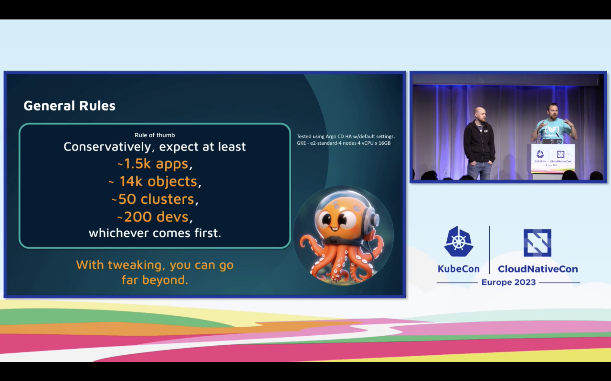

# kubecon2023
Just some notes on KubeCon 2023


# Interesting topics in general

* https://katacontainers.io (isolated containers)
* MicroVMs and weaveworks liquidmetal
* Crossplane with ArgoCD and vcluster (k8s in k8s)
* WebAssembly/WASM with Spin or/and with Kubernetes
* eBPF
* https://www.devspace.sh 


# A CI/CD Platform in the Palm of Your Hand - Claudia Beresford, Weaveworks


## MicroVMs

MicroVMs for a better sweet spot for CI than security-flawed containers or full-blown VMs (see https://itnext.io/microvm-another-level-of-abstraction-for-serverless-computing-5f106b030f15?gi=62ad462da87f).


Deployment on MicroVMs or directly on bare metal:

https://github.com/weaveworks-liquidmetal


clusterctl CLI

> ngrok is a simplified API-first ingress-as-a-service that adds connectivity,
security, and observability to your apps in one line 

https://ngrok.com/


# How We Securely Scaled Multi-Tenancy with VCluster, Crossplane, and Argo CD - Ilia Medvedev & Kostis Kapelonis, Codefresh


3rd option:

https://www.vcluster.com/

k8s cluster in k8s cluster - clusterception


Really cool, here's there are architecture


Install crossplane using Helm with ArgoCD

Demo repo https://github.com/ilia-medvedev-codefresh/kubecon-2023-demo


ArgoCD certification https://learning.codefresh.io/


# Hands on with WebAssembly Microservices and Kubernetes - Jiaxiao Zhou, David Justice & Kate Goldenring, Microsoft & Radu Matei, Fermyon

https://github.com/deislabs/kc-eu-2023-k8s-wasm-microservices

## WebAssembly (Wasm)

> Is a compilation target producing small binaries, that start up really fast


- run inside or outside of the Browser

Wasm supported languages:


### WebAssembly Runtimes:

JavaScript and WASI (server-side)


e.g. https://wasmtime.dev/

WASI features

portable, secure, small, quick


### 3 options to run WebAssembly


* Use a runtime like wasmtime

* Use a framework like spin https://github.com/fermyon/spin

* Use Kubernetes with runwasi


### Spin

> the developer tool for Serverless WebAssembly


> right now there's no multithreading inside Spin applications 

commands remind us to Docker:

```shell
$ spin new

$ spin build

$ spin up
```

Spin produces OCI containers... 

### Workshop

prepare https://github.com/deislabs/kc-eu-2023-k8s-wasm-microservices/blob/main/workshop/00-setup.md

```shell
# install spin
$ curl -fsSL https://developer.fermyon.com/downloads/install.sh | bash
$ sudo mv spin /usr/local/bin/
# check command
spin --version

# configure templates
# Install the official Spin templates.
$ spin templates install --git https://github.com/fermyon/spin --update
$ spin templates install --git https://github.com/fermyon/spin-js-sdk --update

# Install a few templates we will use to build applications.
$ spin templates install --git https://github.com/radu-matei/spin-kv-explorer --update

# Install the JavaScript plugin for Spin.
$ spin plugin install js2wasm -y

```

Spin 101 https://github.com/deislabs/kc-eu-2023-k8s-wasm-microservices/blob/main/workshop/01-spin-getting-started.md

```shell
$ spin new http-ts hello-typescript --accept-defaults && cd hello-typescript

$ tree
.
├── README.md
├── package.json
├── spin.toml
├── src
│   └── index.ts
├── tsconfig.json
└── webpack.config.js
```

build app with

```shell
$ npm install

$ spin build
```

run and access app

```shell
$ spin up

$ curl localhost:3000
```


## Wasm in Kubernetes

https://github.com/deislabs/kc-eu-2023-k8s-wasm-microservices/blob/main/workshop/02-run-your-first-wasm-on-k3d.md


runwasi is a shim implementation to run WebAssembly

Pod spec runtime class defintion - wasmtime-spin

`RuntimeClass` CRD for that:


Create 

```shell
$ k3d cluster create wasm-cluster --image ghcr.io/deislabs/containerd-wasm-shims/examples/k3d:v0.5.1 -p "8081:80@loadbalancer" --agents 2
```

ContainerD can have multiple shims installed (slight + Spin for example)

Multiple RuntimeClasses: https://github.com/deislabs/containerd-wasm-shims/raw/main/deployments/workloads/runtime.yaml

Add kubeconfig to your local config:

```shell
k3d kubeconfig get wasm-cluster
```

Install RuntimeClasses & workload

```shell
kubectl apply -f https://github.com/deislabs/containerd-wasm-shims/raw/main/deployments/workloads/runtime.yaml
kubectl apply -f https://github.com/deislabs/containerd-wasm-shims/raw/main/deployments/workloads/workload.yaml
```

check with 

```shell
echo "waiting 5 seconds for workload to be ready"
sleep 5
curl -v http://127.0.0.1:8081/spin/hello
```

cleanup

```shell
k3d cluster delete wasm-cluster
```


### Deploy Wasm Applications to Kubernetes

https://github.com/deislabs/kc-eu-2023-k8s-wasm-microservices/blob/main/workshop/03-deploy-spin-to-k8s.md

Install the Spin k8s plugin https://github.com/chrismatteson/spin-plugin-k8s :

```shell
$ spin plugin install -y -u https://raw.githubusercontent.com/chrismatteson/spin-plugin-k8s/main/k8s.json
```

Spin scaffold will create Dockerfile with your registry:

```shell
spin k8s scaffold ghcr.io/my-registry  && spin k8s build
```


# Verifiable GitHub Actions with eBPF - Jose Donizetti, Aqua

https://github.com/aquasecurity/tracee

eBPF in GitHub Actions didn't work - so they created tracee:

> because production time is different than build time


-> build time is predictable: clone, build, test, deploy etc.


GitHub Actions for starting and stopping tracing in the CI/CD process


Policies look like this:


# Experience with “Hard Multi-Tenancy” in Kubernetes Using Kata Containers - Shuo Chen, Databricks

VM-isolation instead of Container isolation :)


dedicated CPU, storage, dedicated kernel, K8s networking - container network policies


Special RuntimeClass `kata-qemu`:


### Cons and how to handle them

**Performance!**

3-6x slower

--> because Kata introduces another abstraction layer!


How to handle performance:

* local SSDs instead of CloudProvider default
* SPDK (storage performance development kit) + Kata Direct Volumes
--> develop own CSI at Databricks + Kata Virtual Block device

* CPU isolation, CPU pinning and CPU state tuning:


* NUMA (non uniform memory access): prevent Kata VM using cross NUMA resources
* autobalancing load for different NUMA nodes on same host
--> done with NUMA control


### Other Cons

* more infrastructure resources needed than vanilla k8s
--> need to allocate additional Kata Container overhead
* GPU-load not really great for Kata


# Unlocking Argo CD’s Hidden Tools for Chaos Engineering - Featuring VCluster and More - Dan Garfield & Brandon Phillips, Codefresh

> When is one ArgoCD instance not enough anymore?

A ton of tweaks for performance etc. in Argo





https://github.com/argoproj/argo-cd/tree/master/hack/gen-resources

Works with vcluster


Creates clusters, apps, projects and repos

> Sometimes the Kubernetes API is to slow :)

```shell
# build tool
go build -o ../argocd-generator
```

--> Testing ArgoCD instance! This tool uses all example apps from all ArgoCD forks on GitHub

--> ArgoCD (with autopilot?) also deploys vclusters :)))


Bootstrap ArgoCD with autopilot

https://argocd-autopilot.readthedocs.io/en/stable/

```
Argo CD Autopilot saves operators time by:

    Installing and managing the Argo CD application using GitOps.
    Providing a clear structure for how applications are to be added and updated, all from git.
    Creating a simple pattern for making updates to applications and promoting those changes across environments.
    Enabling better disaster recovery by being able to bootstrap new clusters with all the applications previously installed.
    Handling secrets for Argo CD to prevent them from spilling into plaintext git. (Soon to come)

The Argo-CD Autopilot is a tool which offers an opinionated way of installing Argo-CD and managing GitOps repositories.
```

Check ArgoCD with Prometheus if using big deployments


